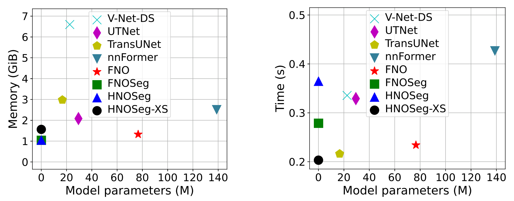
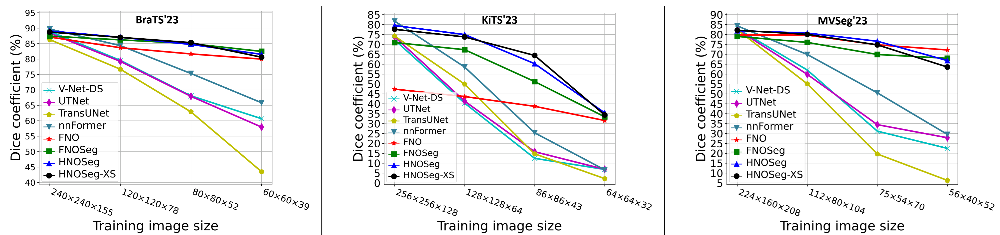

# Multimodal Image Segmentation

## Highlights

:white_check_mark: Resolution robust, computationally efficient, and extremely small models  
:white_check_mark: Self-normalizing neural networks  
:white_check_mark: Trained end-to-end, no specialized training algorithms are required  
:white_check_mark: Written in PyTorch

This repository contains our image segmentation models applicable to both 2D and 3D segmentation. Our most recent HNOSeg-XS (e**X**tremely **S**mall **H**artley **N**eural **O**perator for **Seg**mentation) architecture, apart from its intrinsic zero-shot super-resolution property, it is also computationally efficient and extremely parameter efficient. When tested on the BraTS'23, KiTS'23, and MVSeg'23 datasets with a Tesla V100 GPU, HNOSeg-XS showed its superior resolution robustness with fewer than **34.7k** model parameters. It also achieved the overall best inference time (< 0.24 s) and memory efficiency (< 1.8 GiB) compared to the tested CNN and transformer models. This repository also contains the model architectures of our previous [publications](#publications), including HartleyMHA, FNOSeg3D, and V-Net-DS. Please see the [technical details](#technical-details) for installation and running.



*Fig. 1: Computational requirements of tested models on a single image, with average values from three datasets.*



*Fig. 2: Comparisons of robustness to training image resolutions. Each point represents the average value of different regions of
the testing data. Regardless of the training image sizes, the largest image sizes were used in testing.*

## Technical Details

The code was developed with Python 3.10.12 and PyTorch 2.5.1. If you are only interested in the architectures, the [`nets`](nets) module is all you need, though the hyperparameters are stored under [experiments/config_files](experiments/config_files) as they are dataset specific. Experimental setups such as data splits and training procedure are in the [`experiments`](experiments) module. The `nets` module is dataset independent, while some functions in the `experiments` module (e.g., dataset partitioning) are dataset specific. We only provide the code for the BraTS'23 dataset as it is more standardized.

In experiments, arguments are provided through a config file using the Python's module `ConfigParser`. The config file is saved to the output directory for future reference. Examples of the config files used in our experiments are provided under [experiments/config_files](experiments/config_files) for reproducibility.

>**_Note:_**
>1. Although the code is built for both 2D and 3D segmentation, it is not fully tested for 2D segmentation.
>
>2. The PyTorch implementation of the HartleyMHA architecture is not fully tested.
>
>3. The previous TensorFlow implementation is put under [`tensorflow`](tensorflow), which was last updated in April 2024. It does not provide the new features such as the self-normalizing capability, and the segmentation accuracy and efficiency are suboptimal.

### Setting Up the Virtual Environment

There are multiple Python packages required to run the code. You can install them by the following steps:

1. Create a virtual environment (https://docs.python.org/3/library/venv.html):
   ```
   python -m venv /path/to/new/virtual/environment
   ```
   You can check the Python version with `python -V`. 

2. Upgrade `pip` in the *activated* virtual environment:
   ```
   pip install --upgrade pip
   ```
   This is important as the installed `pip` version can be outdated and the subsequent steps may fail.

3. Clone and install the repository:
   ```
   git clone https://github.com/IBM/multimodal-3d-image-segmentation.git
   pip install multimodal-3d-image-segmentation/
   ```
   > **_Note:_** The software package `graphviz`(https://graphviz.org/) is required to plot the model architecture. If you encounter the corresponding runtime error, you can either install `graphviz` (e.g., by `sudo apt install graphviz` in Linux), or set `is_plot_model = False` in the training config file to skip `plot_model`.

4. Use the following code to verify the installation:
   ```
   from multimodal_3d_image_segmentation import nets
   model = nets.HNOSegXS(4, 4, 24, [3, 3, 3, 3, 3, 3, 3, 3], (10, 14, 14), device='cuda')
   print(sum(p.numel() for p in model.parameters()))
   ```
   You should see the number of model parameters as 28248. You can change `device='cuda'` to `device='cpu'` if no GPU is available.


### Data Partitioning

The [experiments/brats23_data_preparation](experiments/brats23_data_preparation) folder contains the script and config file for partitioning the BraTS'23 dataset. The program goes through the dataset folders to extract the patient IDs and groups them into training, validation, and testing sets. The resulted lists of file paths are saved as txt files. To run the script, we first modify the [`config_partitioning.ini`](experiments/brats23_data_preparation/config_files/config_partitioning.ini) config file, then use the command:
```
python partitioning.py /path/to/config_partitioning.ini
```
The split examples used in our experiments are provided under [`split_examples`](experiments/brats23_data_preparation/split_examples).


### Training and Testing

To perform training, we first modify the `config_<arch>.ini` file under [experiments/config_files](experiments/config_files), then run:
```
python experiments/run.py /path/to/config_<arch>.ini
```
where `<arch>` stands for an architecture (e.g., fnoseg). The config files of different architectures are only different in the `[model]` section and `output_dir`. If the program stops before training is completed, add `is_continue = True` in `[main]` in the config file, so that the training can be restarted from the last checkpoint. The default setting saves a checkpoint for every 10 epochs, or when a new best model is available.

Although the above command runs both training and testing, the testing is performed on the same image size as training. To test on a different image size, modify the following in the config file:
1. In `[main]`, change `is_train` to `False`.
2. In `[input_lists]`, change `data_dir`.
3. In `[test]`, change `output_folder`.
4. In `[statistics]`, change `use_surface_dice` and `use_hd95` as needed.


## Publications

1. **HNOSeg-XS** (Please cite this paper if you use our models)

   Ken C. L. Wong, Hongzhi Wang, and Tanveer Syeda-Mahmood, “[HNOSeg-XS: extremely small Hartley neural operator for efficient and resolution-robust 3D image segmentation](https://doi.org/10.1109/TMI.2025.3588458),” *IEEE Transactions on Medical Imaging*, 2025 (in press). [[pdf](https://arxiv.org/pdf/2507.08205)]
    ```
   @article{Journal:Wong:TMI2025:hnoseg-xs,
      title =        {{HNOSeg-XS}: extremely small {Hartley} neural operator for efficient and resolution-robust {3D} image segmentation},
      author =       {Wong, Ken C. L. and Wang, Hongzhi and Syeda-Mahmood, Tanveer},
      journal =      {IEEE Transactions on Medical Imaging},
      year =         {2025},
   }
   ```
   
2. **HartleyMHA**

   Ken C. L. Wong, Hongzhi Wang, and Tanveer Syeda-Mahmood, “[HartleyMHA: self-attention in frequency domain for resolution-robust and parameter-efficient 3D image segmentation](https://link.springer.com/chapter/10.1007/978-3-031-43901-8_35),” in *International Conference on Medical Image Computing and Computer-Assisted Intervention (MICCAI)*, 2023, pp. 364–373. [[pdf](https://arxiv.org/pdf/2310.04466)]
    ```
   @inproceedings{Conference:Wong:MICCAI2023:hartleymha,
      title =        {{HartleyMHA}: self-attention in frequency domain for resolution-robust and parameter-efficient {3D} image segmentation},
      author =       {Wong, Ken C. L. and Wang, Hongzhi and Syeda-Mahmood, Tanveer},
      booktitle =    {International Conference on Medical Image Computing and Computer-Assisted Intervention (MICCAI)},
      pages =        {364--373},
      year =         {2023},
   }
   ```

3. **FNOSeg3D**

   Ken C. L. Wong, Hongzhi Wang, and Tanveer Syeda-Mahmood, “[FNOSeg3D: resolution-robust 3D image segmentation with Fourier neural operator](https://ieeexplore.ieee.org/document/10230586),” in *IEEE International Symposium on Biomedical Imaging (ISBI)*, 2023, pp. 1–5. [[pdf](https://arxiv.org/pdf/2310.03872)]
    ```
   @inproceedings{Conference:Wong:ISBI2023:fnoseg3d,
      title =        {{FNOSeg3D}: resolution-robust {3D} image segmentation with {Fourier} neural operator},
      author =       {Wong, Ken C. L. and Wang, Hongzhi and Syeda-Mahmood, Tanveer},
      booktitle =    {IEEE International Symposium on Biomedical Imaging (ISBI)},
      pages =        {1--5},
      year =         {2023},
   }
   ```

4. **V-Net-DS (V-Net with deep supervision)**

   Ken C. L. Wong, Mehdi Moradi, Hui Tang, and Tanveer Syeda-Mahmood, “[3D segmentation with exponential logarithmic loss for highly unbalanced object sizes](https://link.springer.com/chapter/10.1007/978-3-030-00931-1_70),” in *International Conference on Medical Image Computing and Computer-Assisted Intervention (MICCAI)*, 2018, pp. 612–619. [[pdf](https://arxiv.org/pdf/1809.00076)]
    ```
   @inproceedings{Conference:Wong:MICCAI2018:3d,
      title =        {{3D} segmentation with exponential logarithmic loss for highly unbalanced object sizes},
      author =       {Wong, Ken C. L. and Moradi, Mehdi and Tang, Hui and Syeda-Mahmood, Tanveer},
      booktitle =    {International Conference on Medical Image Computing and Computer-Assisted Intervention (MICCAI)},
      pages =        {612--619},
      year =         {2018},
   }
   ```

5. **Pearson’s Correlation Coefficient (PCC) loss**

   Ken C. L. Wong and Mehdi Moradi, “[3D segmentation with fully trainable Gabor kernels and Pearson’s correlation coefficient](https://link.springer.com/chapter/10.1007/978-3-031-21014-3_6),” in *Machine Learning in Medical Imaging*, 2022, pp. 53–61. [[pdf](https://arxiv.org/pdf/2201.03644)]
   ```
   @inproceedings{Workshop:Wong:MLMI2022:3d,
      title =        {{3D} segmentation with fully trainable {Gabor} kernels and {Pearson's} correlation coefficient},
      author =       {Wong, Ken C. L. and Moradi, Mehdi},
      booktitle =    {Machine Learning in Medical Imaging},
      pages =        {53--61},
      year =         {2022},
    }
    ```
   
## Updates

### 2025-06

1. The new PyTorch implementation replaces the TensorFlow implementation. This PyTorch implementation includes the new and improved models in our IEEE TMI 2025 paper.

### 2024-04

1. Updated the code for the most recent version of TensorFlow (2.16.1).
2. The `datagenerator.py` module is replaced by the `dataset.py` module that uses `PyDataset` in Keras 3. As `PyDataset` is new in Keras 3 and thus TensorFlow 2.16.1, class `InputData` is not backward compatible.

## Contact Information

Ken C. L. Wong (<clwong@us.ibm.com>)
